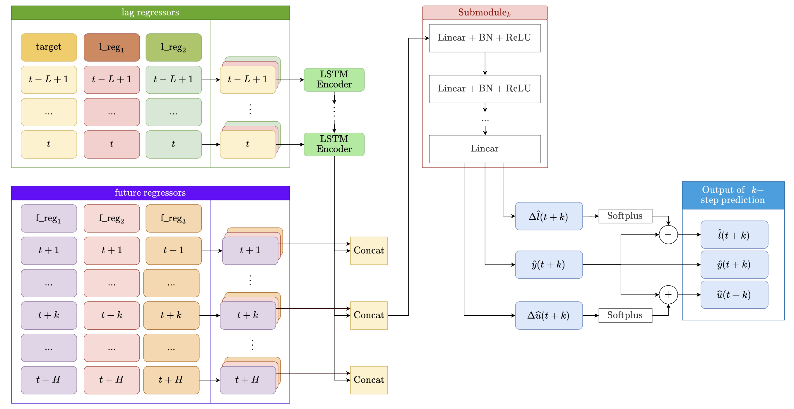
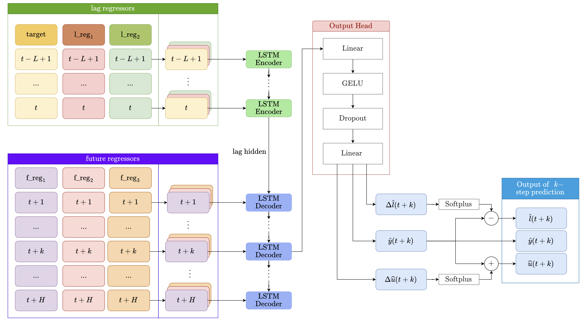
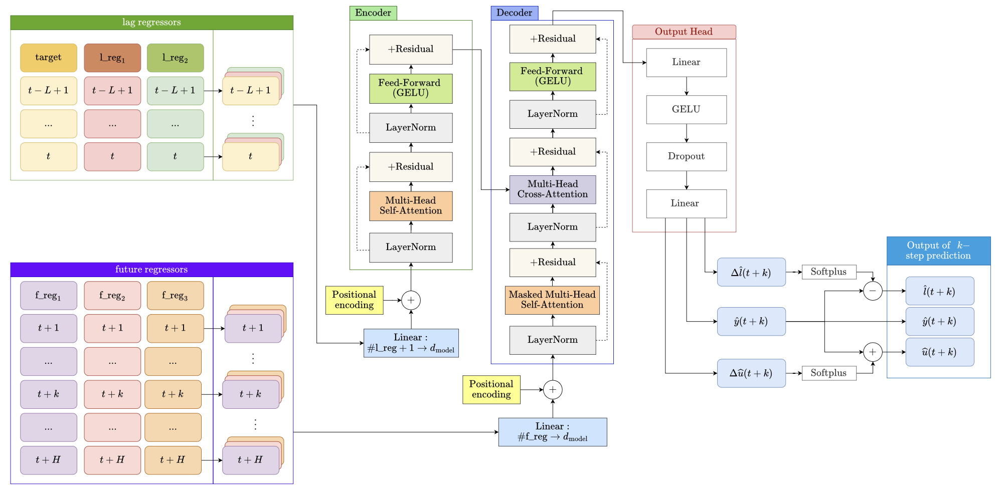
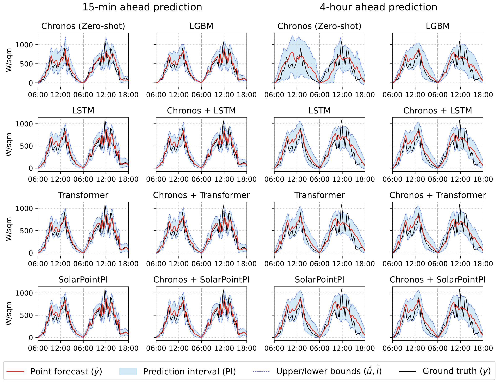
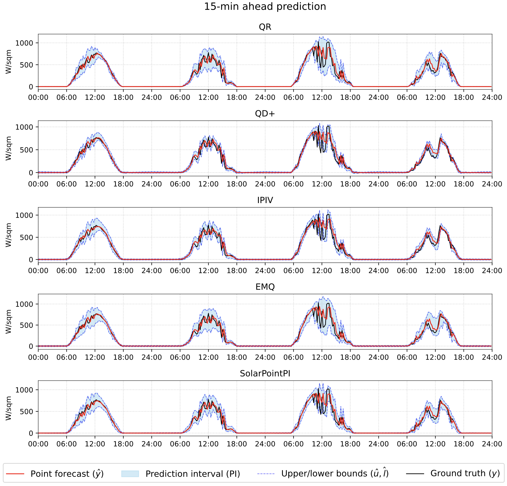
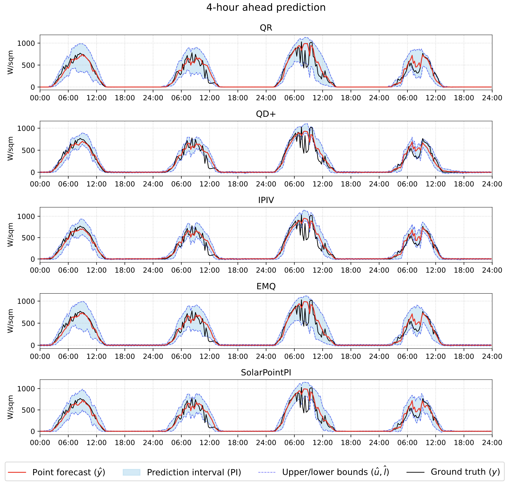

# PI Point Forecast

This GitHub repository contains the code and resources for the paper "Barrier-enforced multi-objective optimization for direct point and sharpinterval forecasting". 

## Abstract
This paper proposes a multi-step probabilistic forecasting framework using a single neural-network based modelto generate simultaneous point and interval forecasts. Our approach ensures non-crossing prediction intervals (PIs) through a model structure design that strictly satisfy a target coverage probability (PICP) while maximizing sharp-ness. Unlike existing methods that rely on manual weight tuning for scalarized loss functions, we treat point andPI forecasting as a multi-objective optimization problem, utilizing multi-gradient descent to adaptively select optimalweights. Key innovations include a new PI loss function based on an extended log-barrier with an adaptive hyperpa-rameter to guarantee the coverage, and a hybrid architecture featuring a shared temporal model with horizon-specificsubmodels. The proposed loss is scale-independent and universally applicable; combined with our training strategy, theframework eliminates trial-and-error hyperparameter tuning for balancing multiple objectives. Validated by an intra-day solar irradiance forecasting application, results demonstrate that our proposed loss consistently outperforms thosein current literature by achieving target coverage with the narrowest PI widths. Furthermore, when compared againstLSTM encoder-decoder and Transformer architectures–including those augmented with Chronos foundation models–ourmethod remains highly competitive and can be seamlessly adapted to any deep learning structure.

## Model Architectures

### Solar Point PI


### LSTM Encoder-Decoder


### Transformer



## Results


### Solar irradiance forecasts (W/sqm) comparing model architectures horizons.



### Solar irradiance forecasts (W/sqm) comparing loss functions horizons.




---

# Repository Overview

## Repository Structure

```text
.
├── config/          # Hydra configuration files
├── data/            # Raw and processed datasets
├── evaluation/      # Jupyter notebooks for model evaluation
├── model/           # PyTorch neural network model definitions
├── save_model/      # Saved model checkpoints and weights
├── utils/           # Utility functions, metrics, and training helpers
├── gen_cached_data.py # Script to generate cached torch tensor from raw data
├── pyproject.toml
├── README.md
└── train.py         # Main training script
```

### Directory Details

- **`config/`**: Contains YAML configuration files managed by Hydra, including model hyperparameters, optimizers, schedulers, and trainer setups.
- **`data/`**: Stores dataframes and raw PyTorch tensor files (`.pt`) for training, validation, and testing.
- **`evaluation/`**: Includes Jupyter notebooks (e.g., `evaluation.ipynb`, `eval_chronos_zeroshot.ipynb`) and results for evaluating trained and zero-shot models.
- **`model/`**: Contains PyTorch implementations of the forecasting models.
- **`save_model/`**: Directory where the best model checkpoints (`.pth`) and their corresponding configurations are saved during training.
- **`utils/`**: Helper modules containing dataset loaders, loss functions, evaluation metrics, and the main trainer logic.

## Dependencies

This project is managed by [uv](https://docs.astral.sh/uv/). To install `uv`, run the appropriate command for your operating system:
```bash
# For Linux and macOS
curl -LsSf https://astral.sh/uv/install.sh | sh
```
```powershell
# For Windows PowerShell
powershell -ExecutionPolicy ByPass -c "irm https://astral.sh/uv/install.ps1 | iex"
```

The project requires Python 3.13. You can install it using `uv`:
```bash
uv python install 3.13
```

After installing `uv` and Python 3.13, install the project dependencies by running:
```bash
uv sync
```

## Experiment

#### Logging Experiment Results with "Weights & Biases" (Optional)

For experiment tracking using [wandb](https://wandb.ai/), please copy `.env.example` to `.env` and fill in your `WANDB_API_KEY`. You can obtain an API key by creating an account on [wandb](https://wandb.ai/).


### Training
The training script is located at [`train.py`](train.py). It is managed by [Hydra](https://hydra.cc/), and the configuration files can be found in the [`config`](config) directory. 

For example, to train the `lstm_encdec` model for 1,000 epochs, run:
```bash
uv run train.py model=lstm_encdec run.max_epochs=1000 
```

Please refer to the [`config`](config) directory for more details on available configuration options.

### Evaluation

The evaluation scripts are located in the [`evaluation`](evaluation) directory. There are two notebooks for evaluation:

- [`evaluation.ipynb`](evaluation/evaluation.ipynb): Loads the pretrained model and evaluates it on the test set.
- [`eval_chronos_zeroshot.ipynb`](evaluation/eval_chronos_zeroshot.ipynb): Performs zero-shot evaluation for the Chronos-2 model on the test set without any fine-tuning.
